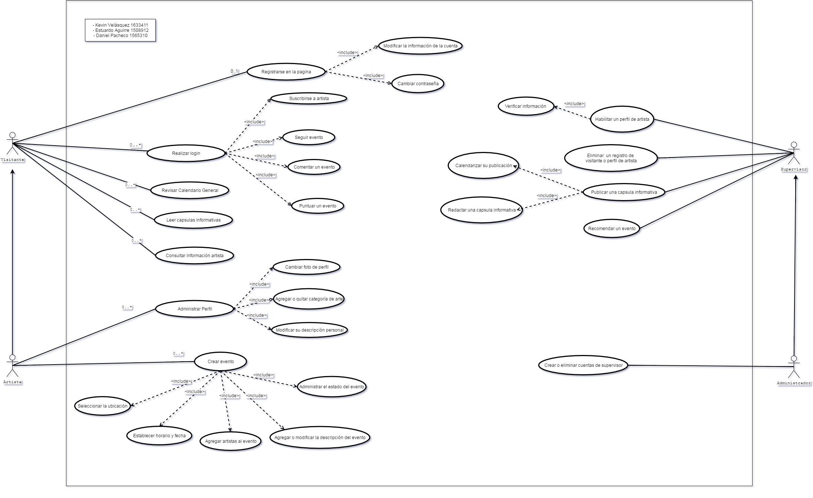

Diseño de la aplicacíon
=======================

Casos de Uso
------------

A continuación de presentará el diagrama de casos de uso, en el cual se representa
de de forma gráfica los distintos actores que tendrá el sistema, es decir los distintos
tipos de usuarios que tendrán interacción con el programa y las distintas actividades
que cada uno de ellos podrá realizar en el programa, según el nivel de acceso que tengan.

    Diagrama de casos de uso general

Clases
------

Diagramas de clases y de sus distintas actividades, si fuese necesario.

Diagrama de BD
--------------

Diagrama de la Base de Datos que requerirá el software.
